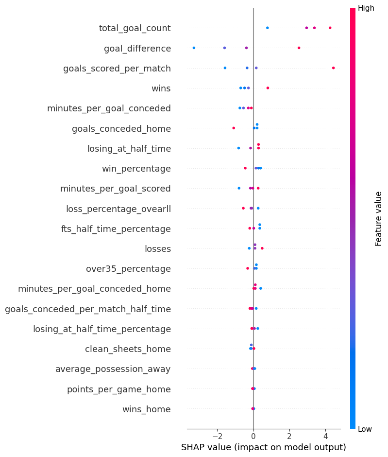
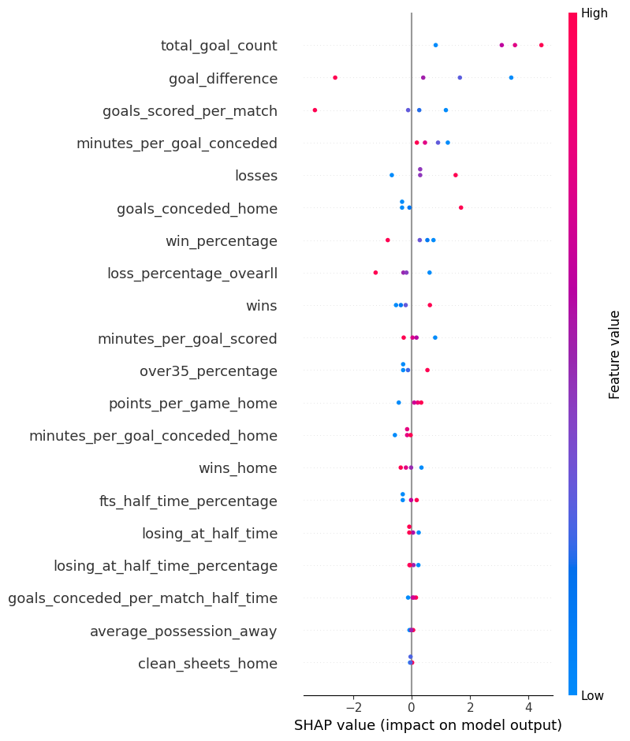

## Hipóteses

**Times com mais gols no campeonato tendem a marcar o primeiro gol:**

Essa hipótese busca confirmar que os times que mais marcam no campeonato tendem a marcar o primeiro gol de suas respectivas partidas

Nota:

Para acessar o modelo preditivo deste notebook, clique no link Notebook Modelo.

Para acessar a hipótese, clique no link Notebook Hipótese.

&nbsp;&nbsp;&nbsp;A hipótese inicial proposta, "Times com mais gols no campeonato tendem a marcar o primeiro gol", foi testada para entender a correlação entre o número total de gols de uma equipe e sua probabilidade de abrir o placar em um jogo. Esse teste envolveu a utilização de alguns modelos preditivos, entre eles, o Random Forest Classifier.

&nbsp;&nbsp;&nbsp;Modelos de classificação servem para prever uma classe ou categoria de uma observação. Na previsão do primeiro gol existem duas opções, ou o time da casa ou o time de fora marcam primeiro, sendo assim, pode-se classificar os resultados entre verdadeiro ou falso, por isso, a utilização de um modelo de classificação é o indicado. Por meio de pesquisas, foi encontrado o algoritmo Random Forest Classifier, que utiliza métodos de randomização e de geração de árvores, por esse motivo, foi o algoritmo escolhido.

## Desempenho Geral do Modelo:

&nbsp;&nbsp;&nbsp;O modelo Random Forest Regressor foi escolhido por combinar múltiplas árvores de decisão para melhorar a precisão das previsões, aproveitando a aleatoriedade na seleção de amostras e características dos dados. Abaixo estão as métricas de desempenho:

- Precisão: 0.88
- Acurácia: 0.83
- _recall_: 0.83
- _F1-score_: 0.83

&nbsp;&nbsp;&nbsp;Com isso, o modelo demonstrou uma tendência a prever corretamente o time que marca o primeiro gol, mesmo em partidas de times com alta diferença no total de gols.

Importância das Variáveis:

&nbsp;&nbsp;&nbsp;A análise das variáveis mais importantes revela que as variáveis de gols totais de um time, tempo que saiu o primeiro gol do time de fora de casa e o tempo que saiu o primeiro gol do time de casa impactam diretamente as previsões. Entre as mais influentes estão:

* [total_goal_count]: Indica a quantidade de gols total de um time e demonstra uma importância de 0.47
* [away_team_first_goal]: indica o tempo que saiu o primeiro gol do time de fora de casa e demonstra uma importância de 0.13
* [home_team_first_goal]: indica o tempo que saiu o primeiro gol do time de casa e demonstra uma importância de 0.13

&nbsp;&nbsp;&nbsp;Com isso, as variáveis foram corretamente utilizadas, atingindo os objetivos iniciais do grupo, que era utilizar da hipótese discorrida para acertar o time que marcará o primeiro gol em partidas futuras.

## Plano de Contingência

&nbsp;&nbsp;&nbsp;Para garantir que o modelo continue atendendo aos requisitos de desempenho e precisão, o plano de contingência inclui várias estratégias de monitoramento e ajuste:

* Monitoramento Contínuo dos Dados: Será implementado um processo de monitoramento contínuo para identificar e corrigir potenciais mudanças nas características dos novos dados, especialmente no que diz respeito a padrões de gol. Isso permite identificar se o modelo começa a perder precisão caso haja modificações nas estratégias dos times ou alterações na escalação, por exemplo.

* Monitoramento de falhas: Caso uma série de predições erradas seja detectada, uma análise humana deverá ser realizada com o objetivo de diagnosticar o problema, para que, dessa maneira, a origem das predições falhas possa ser determinada.
Correção de falhas: Após o diagnóstico, as falhas encontradas no modelo devem ser corrigidas e revisadas.

* Re-treinamento: Antes da reaplicação do modelo agora corrigido, este deve ser testado e validado como garantia de que as falhas previamente encontradas foram corrigidas.

## Explicabilidade do Modelo
      
&nbsp;&nbsp;&nbsp;A explicabilidade de um modelo refere-se à capacidade de compreender os resultados de um modelo de machine learning, obtendo os resultados das features, identificando quais variáveis impactam positivamente ou negativamente nas previsões. Ela permite que usuários e desenvolvedores compreendam as predições de um modelo, o que garante a qualidade da aplicação e auxilia nas futuras implementações no sistema.

&nbsp;&nbsp;&nbsp;Com base nisso, utilizamos um modelo desenvolvido para testar a explicabilidade e garantir o bom funcionamento das previsões em geral. Com o algoritmo de Regressão Logística, foram gerados os seguintes gráficos:

Figura 1 - Explicabilidade home 

 
Fonte: Material produzido pelos DataMiners (2024)

  

Figura 2 - Gráfico das features away 

 
Fonte: Material produzido pelos DataMiners (2024)

  

&nbsp;&nbsp;&nbsp; Esses gráficos foram gerados a partir do SHAP, em suma, o SHAP visualiza como cada característica de um modelo de aprendizado de máquina contribui para suas previsões, permitindo uma compreensão clara do impacto de cada feature nas previsões feitas pelo modelo. No eixo Y estão listadas as características, enquanto o eixo X representa os valores SHAP, que medem a contribuição de cada coluna para as previsões. Cada bolinha no gráfico representa uma observação específica do conjunto de dados, com sua posição ao longo do eixo X indicando se a característica teve um efeito positivo ou negativo na previsão. A cor das bolinhas frequentemente reflete o valor da característica, ajudando a identificar padrões de impacto e a variabilidade entre as observações. 
Através desses gráficos gerados, é possível perceber quais variáveis estão impactando positivamente ou negativamente o modelo.

Quadro 1 - Explicabilidade home 

| Características                                     | Descrição                            |
|-----------------------------------------------------|-------------------------------------|
| total_goal_count                                    |Todas as bolinhas estão no lado positivo, ou seja, todas impactam positivamente|
| goal_difference                                     |Três bolinhas estão do lado positivo, indicando um bom impacto no modelo|
| goals_scored_per_match                              |Parece equilibrado, já que duas bolinhas se aproximam bastante do zero e as outras duas estão uma de cada lado|
| wins                                                |Apresenta três bolinhas do lado negativo, indicando impacto negativo|
| minutes_per_goal_conceded                           |Apresenta todas as bolinhas do lado negativo|

Fonte: Material produzido pelos DataMiners (2024)

  

Quadro 2 - Explicabilidade away 

| Características                                     | Descrição                            |
|-----------------------------------------------------|-------------------------------------|
| total_goal_count                                    |Todas as bolinhas estão no lado positivo, ou seja, todas impactam positivamente|
| goal_difference                                     |Três bolinhas estão do lado positivo, indicando um bom impacto no modelo|
| goals_scored_per_match                              |Parece equilibrado, já que duas bolinhas se aproximam bastante do zero e as outras duas estão uma de cada lado|
| minutes_per_goal_conceded                      |Apresenta todas as bolinhas do lado positivo, o que indica impacto positivo|
| losses | Parece equilibrado, já que duas bolinhas se aproximam bastante do zero e as outras duas estão uma de cada lado

Fonte: Material produzido pelos DataMiners (2024)

  

&nbsp;&nbsp;&nbsp;Acima foram demonstradas apenas as melhores 5 features para cada previsão, mas através do gráfico é possível perceber o quanto todas as features impactam no modelo. Dessa forma, é possível concluir que o modelo de Regressão Linear tem explicabilidade e que está gerando os resultados da forma correta, identificando variáveis que ajudam ou atrapalham o modelo, trazendo a segurança e confiabilidade das previsões.

